<p align="center">
  
</p>

<p align="center">
  
</p>

<p align="center">
  <a href="https://www.youtube.com/watch?v=KupIZHFTL90"></a>
  &nbsp;
  
  &nbsp;
  
  &nbsp;
  
</p>

<p align="center"><b>Created by ZynTarvo</b> · <i>Nothing Is Impossible</i></p>

---

The world’s first web **Control Panel** for [Evilginx](https://github.com/kgretzky/evilginx2) — plus a fully automatic installer.

No Linux wizardry. No coding. Enter the server IP and password, click Install, and get a working Evilginx C2 with a browser dashboard: phishlets, lures, sessions, domains, services.

Built for red teamers, pentesters, and anyone who wants Evilginx running in minutes instead of fighting the terminal for hours.

- Auto-install on Ubuntu
- Web C2 panel with login
- Manage phishlets, lures and captured sessions from the browser
- **Proxy Manager** — deploy Linode proxies in a couple of clicks, assign them to phishlets, watch live traffic
- E-Terminal (Evilginx CLI) and a full Linux shell in the browser
- Live host Health (CPU, RAM, disk, traffic) and per-service journalctl follow

## Demo

<p align="center">
  <a href="https://zyntarvo.github.io/EVILGINX-Control-Panel/#installer">
    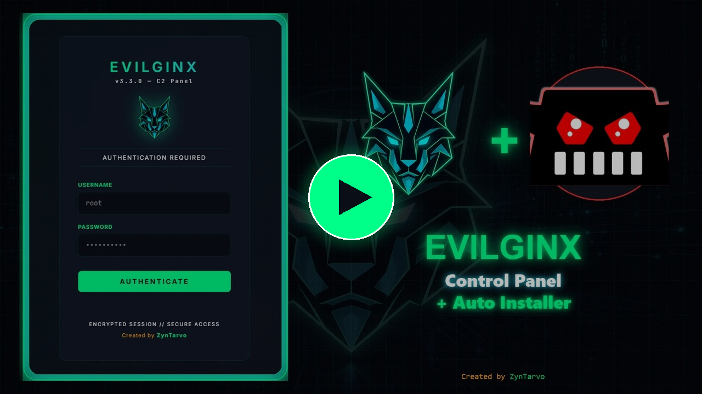
  </a>
</p>

<p align="center">
  <a href="https://zyntarvo.github.io/EVILGINX-Control-Panel/#v35">
    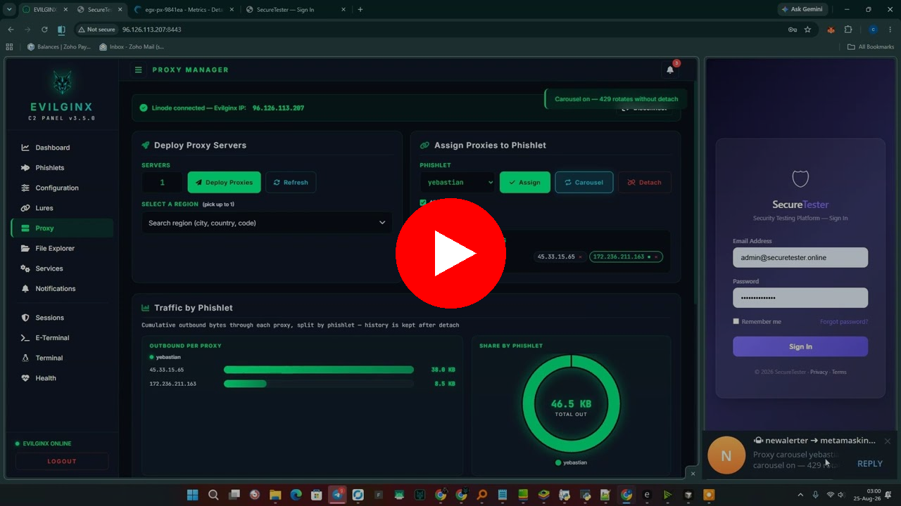
  </a>
  <br>
  <a href="https://youtu.be/k0fQF4_5x6c">YouTube — Evilginx Control Panel v3.5: Auto Proxy Manager + Carousel</a>
</p>

## A note on authorship

This project does **not** steal anyone’s work.

[Evilginx2](https://github.com/kgretzky/evilginx2) is the original engine by **Kuba Gretzky (@mrgretzky)**. We clone it cleanly, then add a web control panel and a one-click installer on top — so people who are just starting in cybersecurity can use the tool without living in the command line.

Think of it as a companion: the same Evilginx, made simpler to install and operate. After clone, the installer patches `core/http_proxy.go` so an origin HTTP **429** is reported to the panel (`/api/internal/egx-429`) and Proxy Manager can rotate the hop.

## Install

**Requirements:** Windows PC with Python 3, and a fresh Ubuntu 20.04 / 22.04 / 24.04 / 26.04 server (root SSH).

1. Clone this repository
2. Double-click `START.bat` (or run `python evilginx_setup.py`)
3. Fill in **IP**, **SSH port**, **username**, **password**
4. Wait for the installer to finish

The installer installs Go 1.20, frees DNS port 53, clones evilginx2, builds it, uploads this panel, and starts both as systemd services.

Panel URL: `http://YOUR_SERVER_IP:8443`  
Login is the same as SSH (user + password).

## Login

<p align="center">
  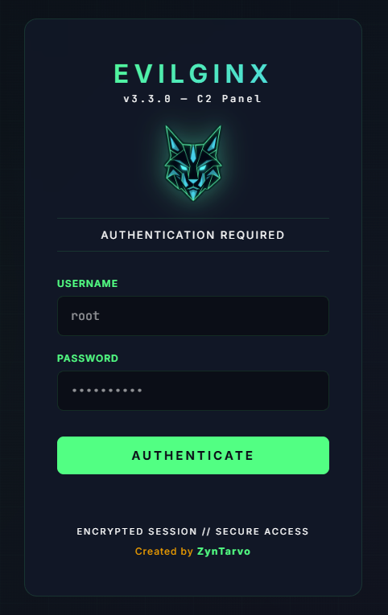
</p>

Encrypted session, username / password, neon lynx mark. Also works on mobile:

<p align="center">
  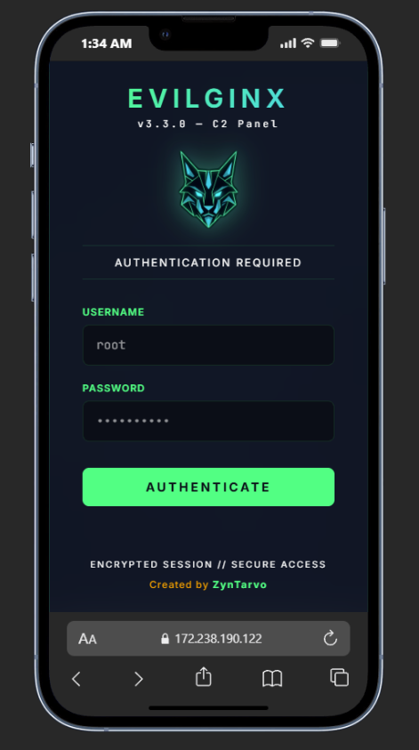
  &nbsp;
  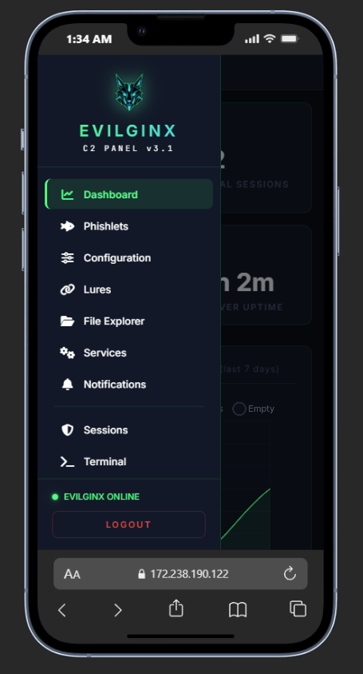
</p>

## Control Panel — every menu

The sidebar is the whole product. Each page below is what you see after login.

<p align="center"></p>

### Dashboard

<p align="center">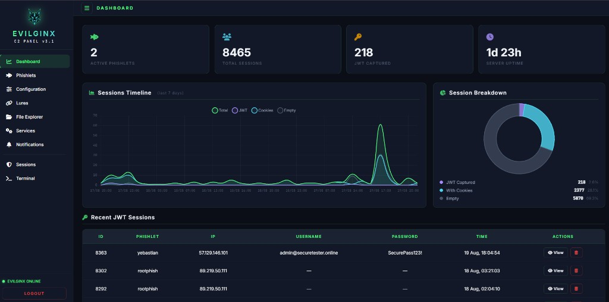</p>

Home screen. At a glance:

| Block | What it shows |
|---|---|
| **Active Phishlets** | How many phishlets are currently enabled |
| **Total Sessions** | All captured visitor sessions |
| **JWT Captured** | Sessions where a JWT was taken (cookie value looks like `eyJ…`) |
| **Server Uptime** | How long the panel host has been up |
| **Sessions Timeline** | Last 7 days: total / JWT / cookies / empty |
| **Session Breakdown** | Donut chart of JWT vs cookies vs empty |
| **Recent JWT Sessions** | Latest successful JWT rows with View / Delete |

### Phishlets

<p align="center">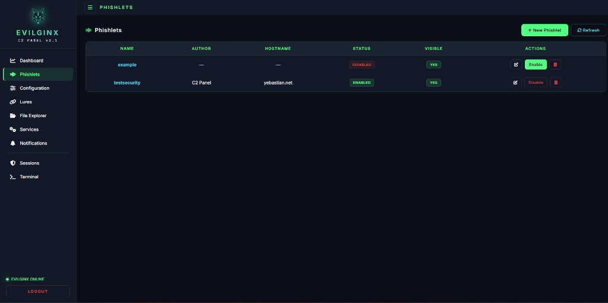</p>

YAML modules that tell Evilginx how to proxy a target site.

- **+ New Phishlet** — create a new YAML in the phishlets folder
- **Refresh** — reload the list from disk / Evilginx
- Table: **Name**, **Author**, **Hostname**, **Status** (enabled / disabled), **Visible**
- **Edit** — open the in-browser YAML editor (find / replace / save)
- **Enable / Disable** — toggle live on the running Evilginx process
- **Delete** — remove the phishlet file

<p align="center">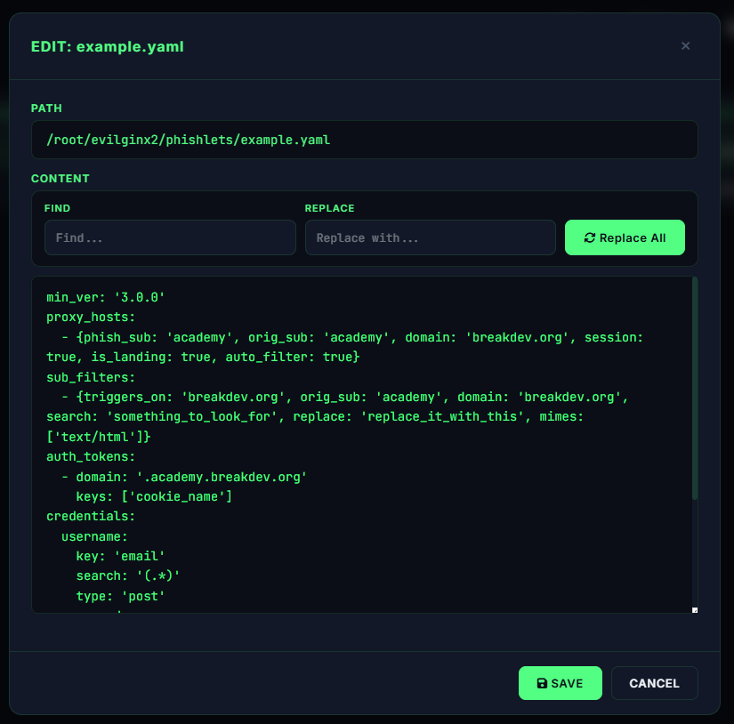</p>

### Configuration

<p align="center">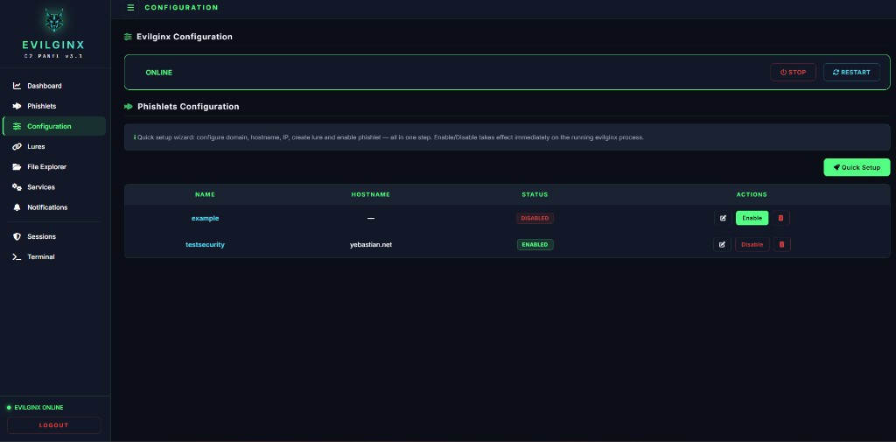</p>

Service control + per-phishlet networking.

- **ONLINE / OFFLINE** — Evilginx process status
- **STOP / RESTART** — stop or bounce the engine
- **Quick Setup** — one wizard: domain, hostname, IPv4, lure path, enable
- Per row: **Edit** hostname / domain / IP / lure / blacklist, **Enable / Disable**, **Delete**

<p align="center">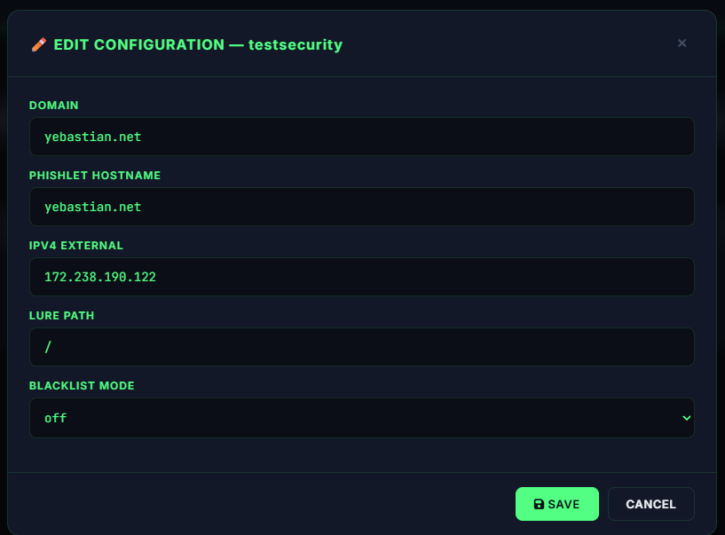</p>

| Field | Meaning |
|---|---|
| **DOMAIN** | Base domain Evilginx answers on |
| **PHISHLET HOSTNAME** | Hostname bound to that phishlet |
| **IPV4 EXTERNAL** | Public IP of the box |
| **LURE PATH** | URL path of the lure (often `/`) |
| **BLACKLIST MODE** | Evilginx blacklist (`off` / unauth / all) |

### Lures

<p align="center">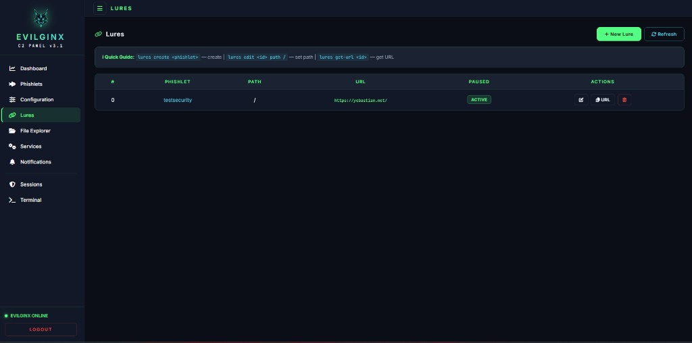</p>

The links you actually send. Each lure is tied to a phishlet.

- **+ New Lure** — create a lure for a chosen phishlet
- Table: **#**, **Phishlet**, **Path**, **URL**, **Paused** (Active / Paused)
- **Edit** — path, redirect URL, UA filter, Open Graph title / description / image / URL
- **Copy URL** — copy the live lure link
- **Delete** — drop the lure

<p align="center">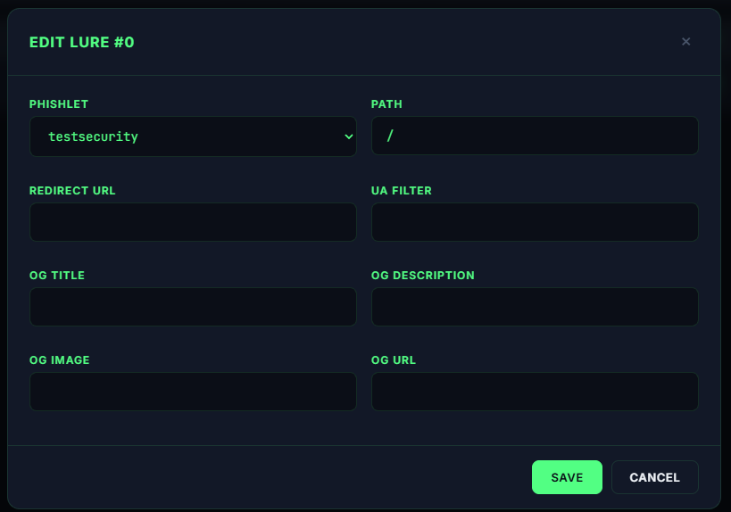</p>

### Proxy

<p align="center">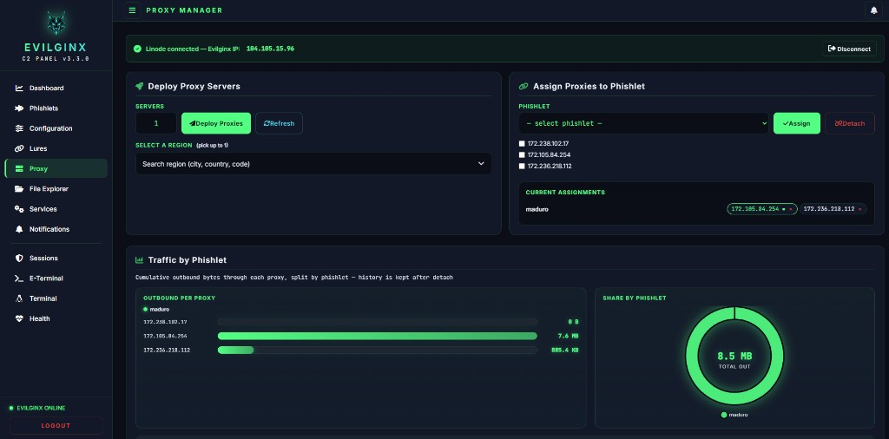</p>

Outbound proxy fleet on Linode, run from the panel — no SSH, no cloud console. Typical path is **four clicks**: paste API key → pick a region → **Deploy** → pick a phishlet and **Assign**.

**Connect**

- Paste a Linode Personal Access Token (the panel stores it on the C2 box)
- Status line shows **Linode connected** and the Evilginx public IP (UFW on each proxy allows only that IP)

**Deploy (a couple of clicks)**

| Step | What you do |
|---|---|
| 1 | Set how many servers (Nanode 1GB) |
| 2 | Search a region by city / country / code, pick up to N regions |
| 3 | Click **Deploy Proxies** |

The progress bar covers the whole job, not just VM create: Linode boot → SSH → cloud-init finished → apt idle → **5 second settle** → Squid on port **50100** with auth. `100%` means the proxy actually answers. Failed installs are **kept** (Repair / Destroy) — the panel never auto-deletes a Linode.

**Assign to a phishlet**

<p align="center">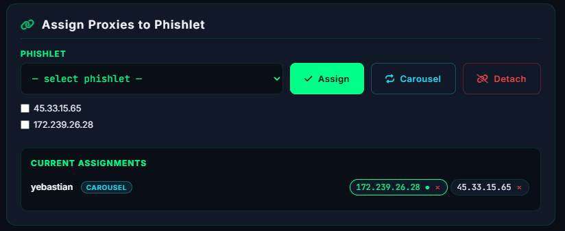</p>

- Choose the phishlet, tick proxy **IP addresses**, click **Assign**
- **Detach** unbinds a proxy from that phishlet (the VM stays; traffic history stays on the charts)
- **Current assignments** shows every phishlet → IP chip (active hop marked with ●)

**Carousel** sits between Assign and Detach. It is per phishlet (the cyan `CAROUSEL` badge on the row means it is on).

| | After 3 origin **429**s in 15 minutes |
|---|---|
| **Off** (default) | Current hop is **detached** from the phishlet (Linode kept). Traffic moves to the next assigned proxy, or the Evilginx server IP if the pool is empty. |
| **On** | Current hop **stays assigned** and is moved to the **end of the queue**. Traffic switches to the next live proxy. A → B → C → A. Live Squid CONNECT tunnels of the old hop are closed so the switch is immediate. |

A node that is still booting is never rotated off. Manual Detach / the chip **×** still unbind as before.

Evilginx is restarted once on Assign so outbound traffic for that phishlet goes through the pool. Origin HTTP **429** is reported by the patched Evilginx binary (`/api/internal/egx-429`).

**Traffic**

<p align="center">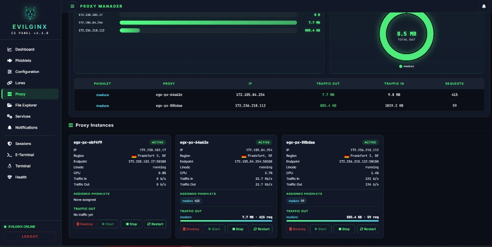</p>

Charts, the assignment chips, and Traffic Out on each proxy card update **live** (same idea as a new JWT on the dashboard). Counters live in RAM on the panel — no extra load on Evilginx and no extra origin requests, even when traffic is heavy. Linode CPU on the cards still refreshes on a slow timer.

- **Outbound per proxy** — bars labelled by **public IP** (not Linode label), split by phishlet
- **Share by phishlet** — donut of total outbound bytes / requests
- Table: phishlet, instance name, IP, bytes out / in, request count
- History is kept after detach, so you still see what that IP already carried

**Instance cards**

<p align="center">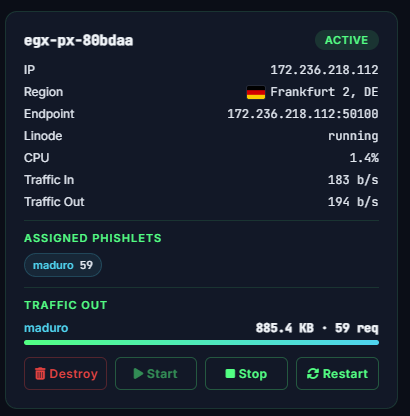</p>

Each Nanode is a card: IP, region + flag, endpoint `:50100`, Linode power state, CPU, live in/out.

- **Assigned Phishlets** — current bind only
- **Traffic Out** — cumulative bytes per phishlet (kept after detach)
- **Destroy** — delete the Linode
- **Start / Stop / Restart** — Linode power (assignments are kept)
- **Repair** — wait for full boot + 5s, then install/verify Squid (instance is never deleted)

The bell (notification centre) logs deploy, repair, 429 rotate, and power events.

### File Explorer

<p align="center">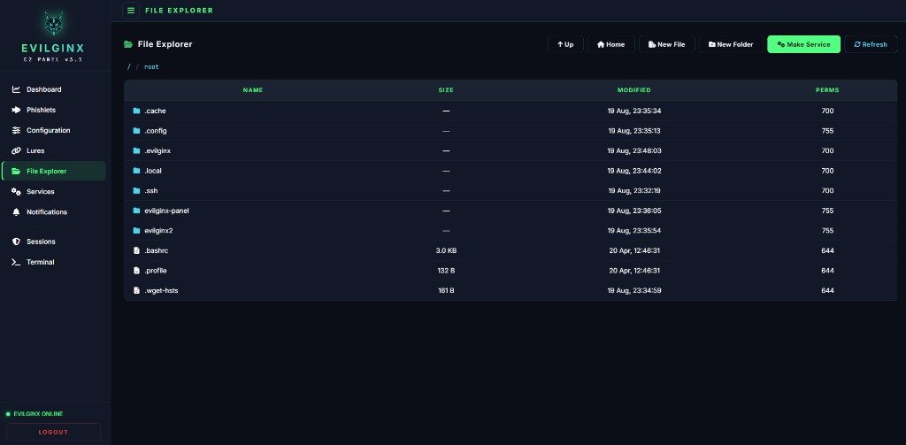</p>

Browse the server from the browser: `/root`, `evilginx2`, `evilginx-panel`, phishlets, configs.

- **Up / Home** — navigate
- **New File / New Folder**
- **Make Service** — turn a script into a systemd unit from the UI
- **Refresh**
- Click a file to view / edit (YAML, configs, etc.)
- Columns: **Name**, **Size**, **Modified**, **Perms**

### Services

<p align="center">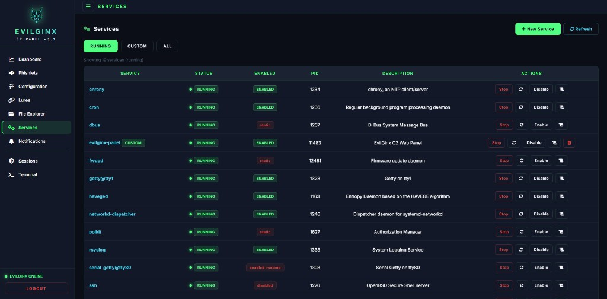</p>

systemd manager so you are not SSH-ing just to restart a daemon.

- Filters: **RUNNING** / **CUSTOM** / **ALL**
- **+ New Service** — register your own unit
- Per service: **Stop**, **Restart**, **Enable / Disable** on boot, **Logs**, **Live journal**, **Delete** (custom units)
- `evilginx-panel` is tagged **CUSTOM** — that is this web panel

### Live journal

<p align="center">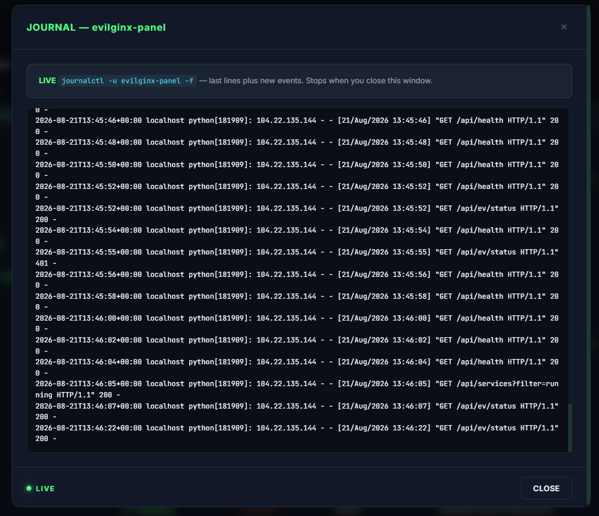</p>

Same lightbox as the other panel forms. The cyan broadcast button on a service row (or **LIVE** inside snapshot logs) runs `journalctl -u SERVICENAME -f`.

- Last lines plus new events in real time
- Follow starts only when you open the window — zero extra load while it is closed
- Stops on **CLOSE**, Escape, or opening another modal
- One live follow at a time

### Notifications

<p align="center">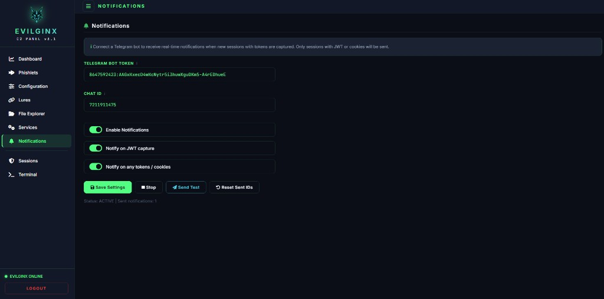</p>

Telegram alerts when a session actually has tokens — not every empty hit.

- **Telegram Bot Token** + **Chat ID**
- Toggles: master enable, notify on JWT, notify on any cookies / tokens
- **Save Settings** / **Stop** / **Send Test** / **Reset Sent IDs**
- Status line shows whether the watcher is active and how many messages were sent

### Sessions

<p align="center">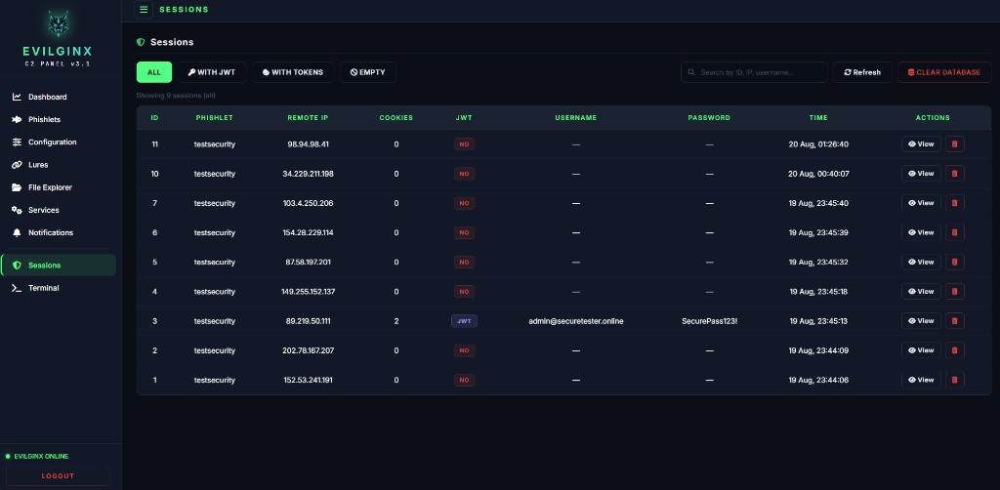</p>

The captured-session database.

- Filters: **ALL** / **WITH JWT** / **WITH TOKENS** / **EMPTY** — each button shows how many records match that filter
- The line under the filters repeats the count for the active filter (and for search)
- Search by ID, IP, username
- **Refresh** / **CLEAR DATABASE**
- Columns: ID, phishlet, remote IP, cookie count, JWT badge, username, password, time
- Click the purple **JWT** badge to open the decoder lightbox
- **View** — full session detail (cookies, tokens)
- **Delete** — remove one row

### JWT Decoder

<p align="center">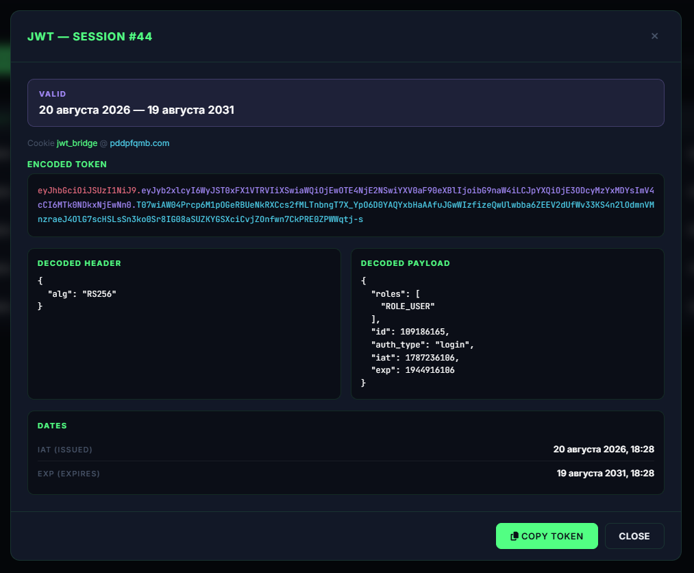</p>

Same lightbox as the other panel forms. Click **JWT** on a session row (or **YES** / the JWT button inside session detail).

- Full encoded token, colored in three parts like [jwt.io](https://jwt.io) (header / payload / signature)
- Decoded header and payload as JSON
- Validity dates in plain language, not Unix timestamps — e.g. `20 августа 2026 — 19 августа 2031`
- Separate issued (`iat`) and expires (`exp`) rows with time
- **Copy token**
- If one session has several JWTs, switch between them by cookie name

Mobile view stacks the same table as cards:

<p align="center">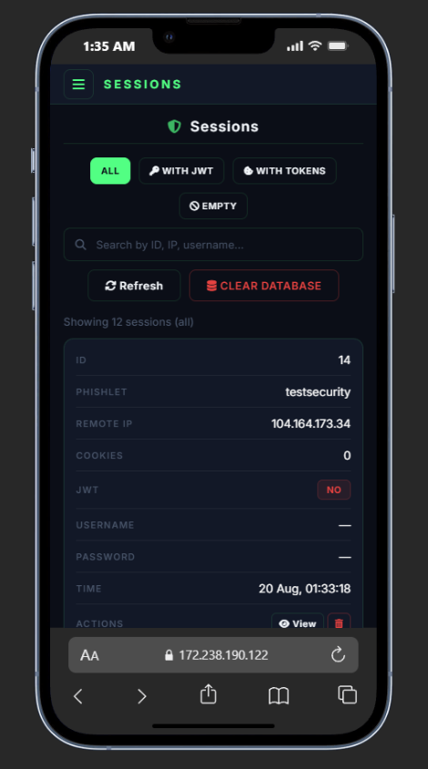</p>

### E-Terminal

<p align="center">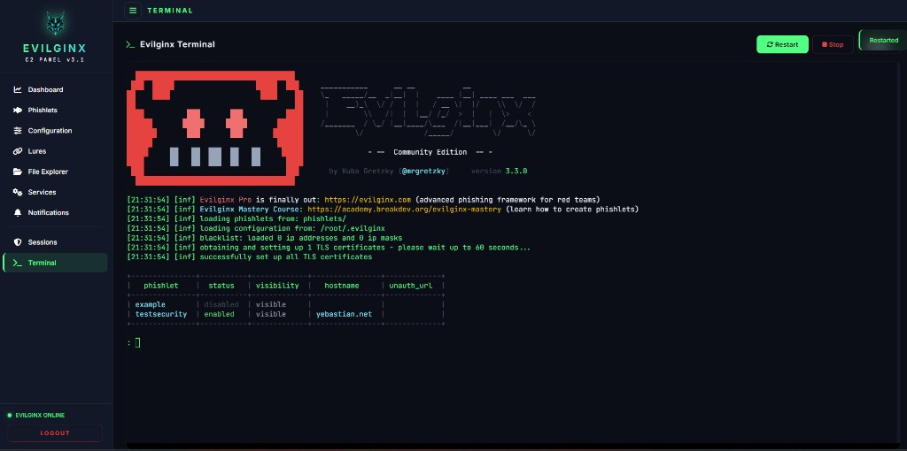</p>

Live **Evilginx** console in the browser (xterm.js). Same commands as the Evilginx CLI: `phishlets`, `lures`, `config`, `sessions`.

- **Restart** / **Stop** / **Start** the Evilginx process from the toolbar
- Output, tables, and the `:` prompt stay on the page — no extra SSH client

### Terminal

<p align="center">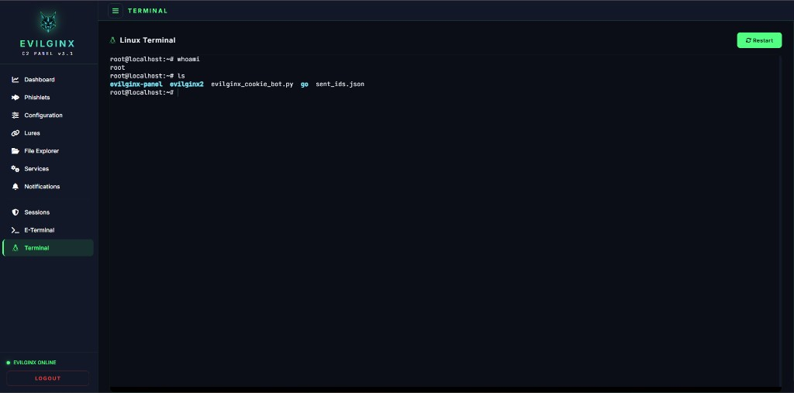</p>

A real Linux shell on the server — login bash, same as if you opened a normal console over SSH.

- Full interactive PTY: `ls`, `apt`, `systemctl`, editors, pipes, Ctrl+C
- Runs as the panel user (root on a default install), home directory, `.bashrc` loaded
- **Restart** if you typed `exit` or the shell died
- Independent from E-Terminal: Evilginx CLI and Linux do not share a session

### Health

<p align="center">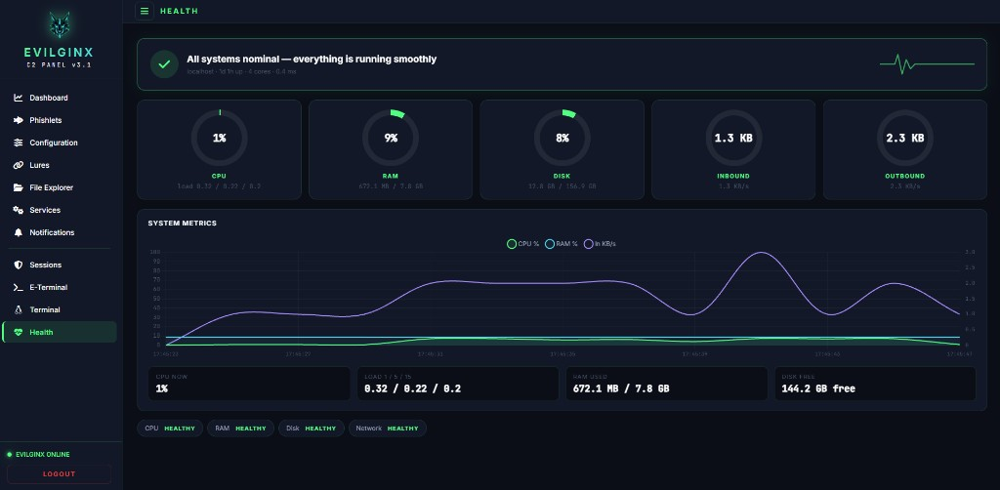</p>

Live host metrics under **Terminal** in the sidebar. Cheap `/proc` reads only while this page is open.

- Banner: **All systems nominal** (or warning / critical)
- Gauges: **CPU**, **RAM**, **Disk**, **Inbound**, **Outbound**
- Chart: CPU %, RAM %, inbound KB/s
- Load 1 / 5 / 15, RAM used, disk free
- Status pills: HEALTHY / WARNING / CRITICAL
- Timer stops when you leave the page or hide the tab — the server is not polled in the background

## Layout

```
START.bat                 → launch the GUI installer
evilginx_setup.py         → SSH installer (Ubuntu 20.04–26.04)
payload/                  → panel that gets uploaded to the server
  app.py
  proxy_engine.py         → Linode fleet, Squid, 429 rotate, carousel, live traffic
  patches/                → apply_egx_429_hook.py (after clone, before go build)
  templates/              → login + dashboard
  static/                 → lynx logo + favicons
docs/screenshots/         → UI shots from the demo video
```

## Support the work

If this panel saved you time and you want to say thank you, USDT on **Ethereum (ERC-20)** is enough:

```
0xFd051b2267b75C9c2513Cb9BAd546e3C51d5dB44
```

No pressure. Use the tool, learn, and pass it on.

## Credits

- **Evilginx2** — [Kuba Gretzky](https://github.com/kgretzky/evilginx2)
- **Control Panel + Auto Installer** — [ZynTarvo](https://github.com/zyntarvo)

<p align="center"><i>ZynTarvo — Nothing Is Impossible</i></p>
